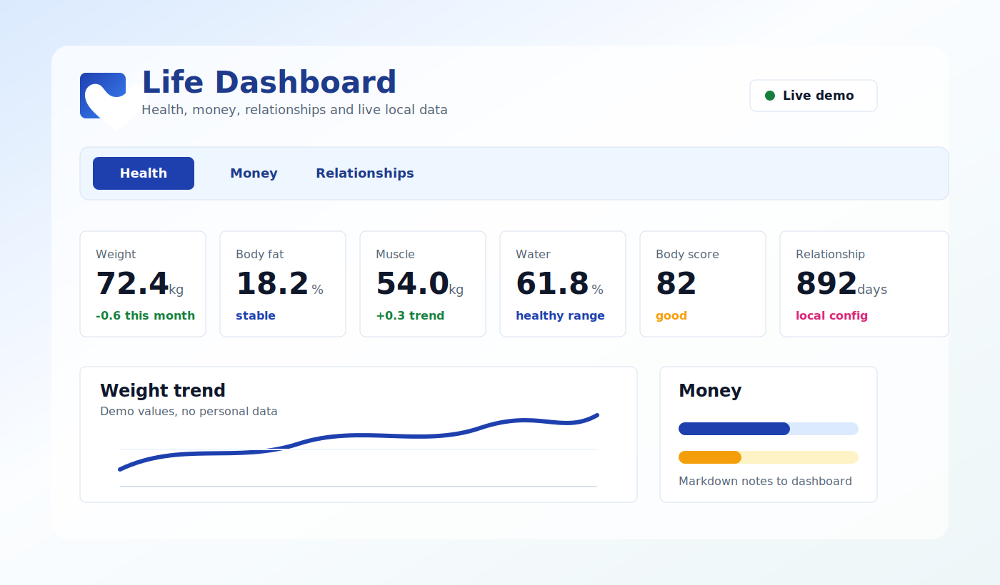
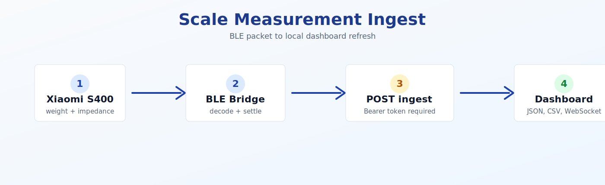

# Life Dashboard

Personal life dashboard for health, money, relationships, and other long-running life domains.



## What It Does

- Tracks Xiaomi Body Scale measurements with charts, metric cards, outlier-aware stats, and WebSocket refreshes.
- Reads a local `Money.md` file and turns finance notes into a dashboard view.
- Updates the money note from ZenMoney accounts through a local sync script.
- Shows a configurable relationship counter with local-only title, dates, and image settings.
- Accepts protected scale measurements through `POST /api/health-data/measurements`.
- Runs as one local Express server that serves the Vite React app and API.

## Privacy Model

This repository is safe for a public GitHub remote:

- Real health exports, money files, `.env*` files, and `data/` are ignored by Git.
- README images use demo values and generated SVG assets.
- Personal names, local IP addresses, hostnames, and absolute home-directory paths are kept out of tracked files.
- Secrets such as `HEALTH_INGEST_TOKEN` and `XIAOMI_SCALE_BINDKEY` belong in local env files or systemd environment files.

## Screens



## Quick Start

```bash
npm install
npm run dev
```

Open:

```text
http://127.0.0.1:5000
```

For LAN access:

```bash
HOST=0.0.0.0 npm run dev
```

## Data Sources

The app uses safe local defaults under `./data`. Put real paths in `.env.local`.

```bash
cp .env.example .env.local
```

Supported configuration:

| Variable | Purpose |
| --- | --- |
| `HEALTH_DATA_DIR` | Directory with Xiaomi Body Scale JSON/CSV/Markdown exports. |
| `HEALTH_DATA_FILE` | Optional direct path to `xiaomi-body-scale-data.json`. |
| `MONEY_DATA_FILE` | Markdown file used by the money dashboard. |
| `MONEY_PARTNER_LABEL` | Optional local label for partner-specific money notes. |
| `ZENMONEY_TOKEN_FILE` | Optional local ZenMoney OAuth token JSON path. |
| `ZENMONEY_CLIENT_ID` | Optional ZenMoney OAuth client id. |
| `ZENMONEY_CLIENT_SECRET` | Optional ZenMoney OAuth client secret. |
| `ZENMONEY_REDIRECT_URI` | Optional ZenMoney OAuth callback URL. |
| `MONEY_SYNC_ENABLED` | Enables server-side scheduled ZenMoney sync. Production default: enabled unless set to `false`. |
| `MONEY_SYNC_START_HOUR` / `MONEY_SYNC_END_HOUR` / `MONEY_SYNC_FINAL_MINUTE` | Server-side money sync window. Defaults: `08:00` through `23:30`. |
| `HEALTH_INGEST_TOKEN` | Enables authenticated POST ingest for scale measurements. |
| `HEALTH_INGEST_DEFAULT_USER` | Optional fallback user for scale payloads without Xiaomi `profile_id`; single-user data files are inferred automatically. |
| `HOST` / `PORT` | Express bind host and port. Defaults: `127.0.0.1:5000`. |
| `VITE_RELATIONSHIP_*` | Local-only relationship title, start date, photo date, caption, and photo URL. |

Local files under `data/assets` are served from `/local-assets/*`, which is useful for private relationship photos kept outside Git.

ZenMoney setup for automatic money-note updates lives in [docs/zenmoney-money-sync.md](docs/zenmoney-money-sync.md).

In production, the Express server can run the ZenMoney sync itself and the money tab refresh button calls `POST /api/money-data/refresh`.

## Scale Ingest

Enable the protected endpoint with a long random token:

```bash
HEALTH_INGEST_TOKEN="replace-with-a-long-random-token" npm run dev
```

Endpoint:

```text
POST /api/health-data/measurements
```

The server accepts Xiaomi S400 BLE bridge payloads, normalizes metrics, updates JSON/CSV files, and broadcasts a dashboard refresh through WebSocket. Full setup notes live in [docs/xiaomi-scale-automation.md](docs/xiaomi-scale-automation.md).

## Project Layout

```text
server/index.ts                    Express API, static app server, WebSocket
server/health-ingest.ts            Scale payload normalization and data writes
scripts/xiaomi-s400-ble-bridge.py  Xiaomi S400 BLE listener
src/App.tsx                        Main React dashboard shell
src/components/                    Health, money, and relationship panels
src/styles.css                     Global dashboard styling
docs/assets/                       Public README images
```

## Commands

```bash
npm run dev      # development server
npm run build    # TypeScript checks and Vite production build
npm run start    # production-mode Express server
npm run money:zenmoney:dry-run  # preview the ZenMoney-derived Money.md row
npm run money:zenmoney:write    # write or update today's Money.md row
```
